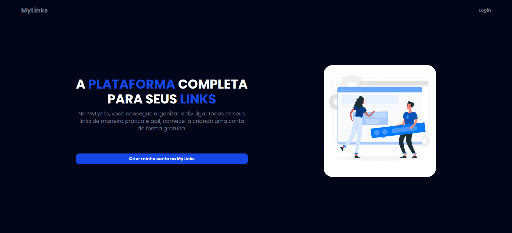
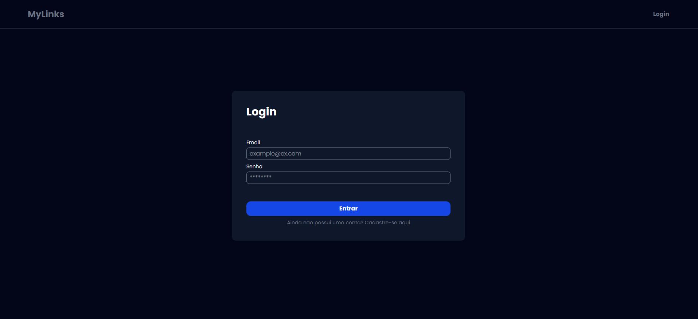
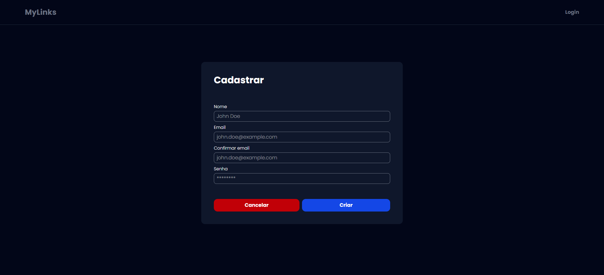
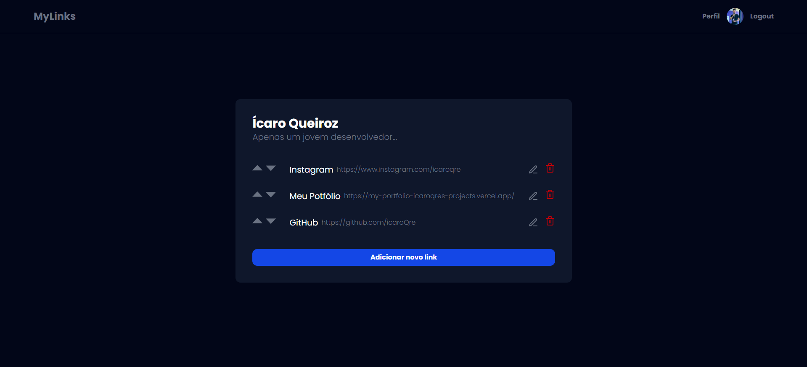
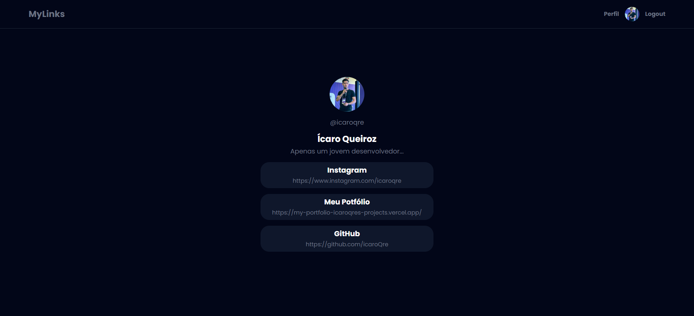
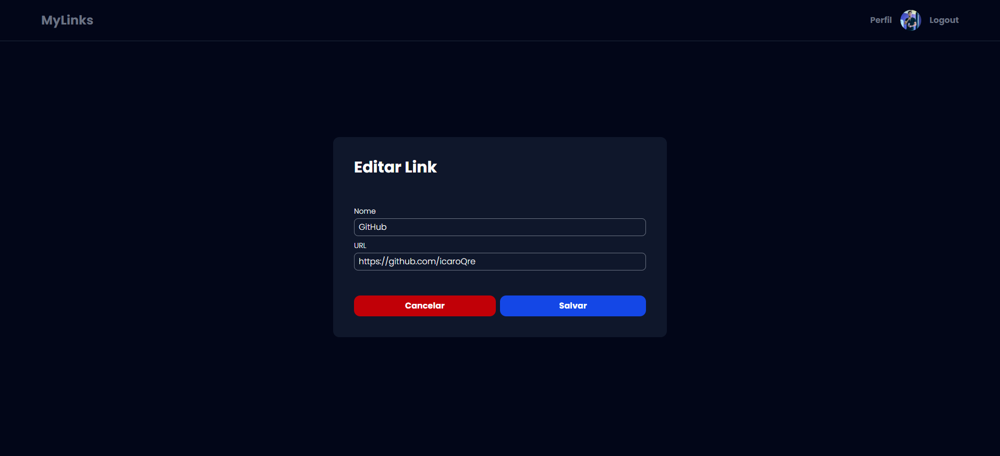
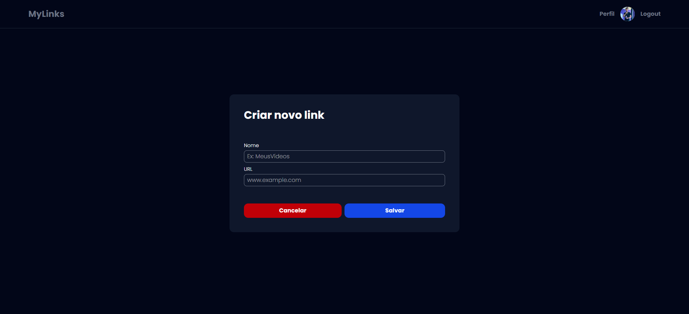
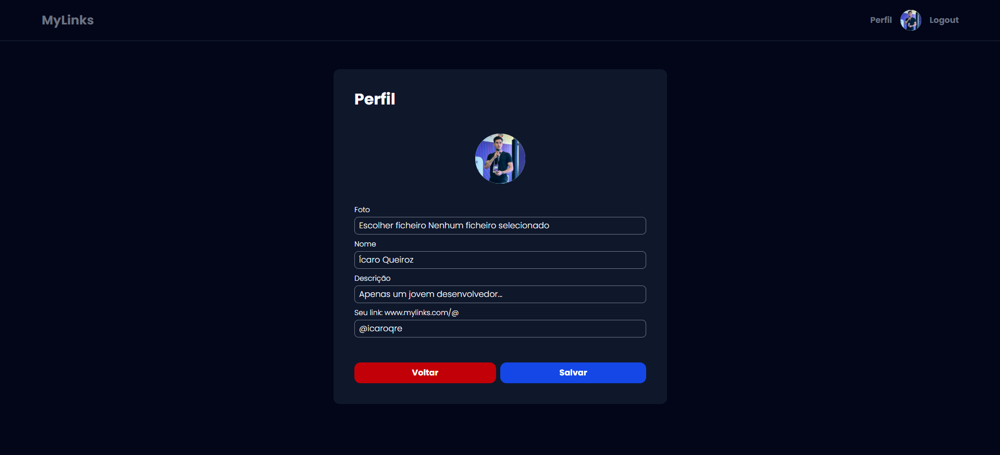

<p align="center"><a href="https://laravel.com" target="_blank"></a></p>

# 📌 MyLinks - Plataforma de Compartilhamento de Links

Repositório para a aplicação MyLinks, uma plataforma que permite aos usuários criar e compartilhar seus links personalizados.



## 🚀 Tecnologias Utilizadas

- **Backend**: Laravel + SQLite
- **Frontend**: Blade Components + Tailwind CSS
- **Estrutura**: MVC (Model-View-Controller)

## ⚙️ Pré-requisitos

Antes de começar, certifique-se de ter instalado em sua máquina:

- [Git](https://git-scm.com/)
- [PHP](https://www.php.net/downloads.php)
- [Composer](https://getcomposer.org/)
- [SQLite](https://www.sqlite.org/download.html)

## 🛠️ Configuração e Execução

### 1️⃣ Clonar o Repositório

```bash
git clone https://github.com/icaroQre/mylinks.git
cd mylinks
```

### 2️⃣ Instalar Dependências

```bash
composer install
npm install
```

### 3️⃣ Configurar o Banco de Dados

```bash
cp .env.example .env
php artisan key:generate
php artisan migrate
```

### 4️⃣ Iniciar o Servidor

```bash
php artisan serve
```

Acesse a aplicação no navegador:
- **Frontend e Backend**: [http://localhost:8000](http://localhost:8000)

## 🛠️ Funcionalidades

- Cadastro e login de usuários.
- Criação, edição e exclusão de links personalizados.
- Personalização de perfil (foto, descrição e handle).
- Página pública para exibição dos links compartilhados.

## 🛑 Parar o Servidor

Para interromper a execução do servidor:

```bash
CTRL + C
```

## 📸 Capturas de Tela

### 🔐 Tela de Login
Interface para autenticação dos usuários.


### 📝 Tela de Registro
Permite que novos usuários criem uma conta.


### 📊 Dashboard
Painel onde os usuários podem gerenciar seus links.


### 🌐 Perfil Público
Exibe os links do usuário para o público.


### ✏️ Edição de Link
Permite modificar os links cadastrados.


### ➕ Criação de Link
Interface para adicionar novos links.


### 👤 Edição de Perfil
Usuários podem personalizar sua foto, descrição e handle.


## 📜 Licença

Este projeto está sob a licença MIT.

